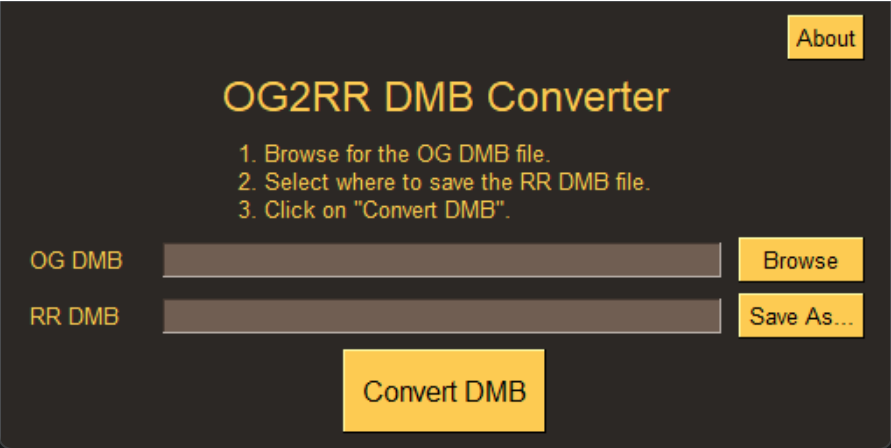

# OG2RR DMB Converter

This program converts `descr_model_battle.txt` (DMB) from _Rome: Total War_ (OG) to _Total War: Rome Remastered_ (RR).

## Notes

For convenience, the converter sets the `pbr_texture` for all models to `data/characters/textures/generic_pbr.tga`. If you wish to add custom PBR textures to models, please modify the relevant line manually after conversion.

If any models are missing textures, the program will inform the user after conversion. A text file listing which models are missing textures will be saved as `og2rr_log.txt`.

Please note that this converter coerces the output to 4 LODs regardless of how many were contained in the input. If an entry had fewer than 4 `model` lines, copies are made to reach 4; if it had more, only the top 4 LODs are retained. Draw distances are also coerced to the following schema (as per built-in skeletons):

| Skeleton Type | Draw Distances |
| ------------- | -------------- |
| Default       | 15/30/40/max   |
| Horse         | 25/55/80/max   |
| Elephant      | 30/60/120/max  |
| Camel         | 15/30/60/max   |

## Screenshot

Brought to you by the EB Online Team
