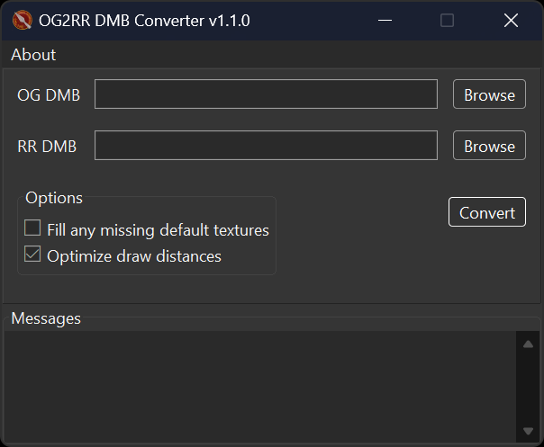

# OG2RR DMB Converter

This program converts `descr_model_battle.txt` (DMB) from _Rome: Total War_ (OG) to _Total War: Rome Remastered_ (RR).

## Notes

For convenience, the converter sets the `pbr_texture` for all models to `data/characters/textures/generic_pbr.tga`. If you wish to add custom PBR textures to models, please modify the relevant line manually after the conversion process.

Any models missing `texture` lines are skipped. If any such models exist, the program will alert the user after the conversion process, indicating the number of skipped models. A text file listing the missing models will be saved as `og2rr_error.txt`.

## Screenshot

Brought to you by the EB Online Team
